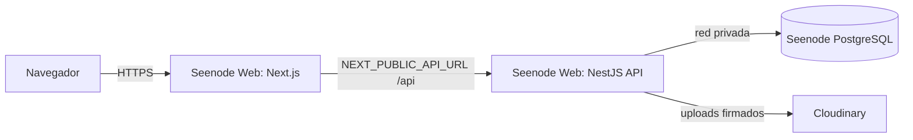

# Reto de Constancia 🏃‍♂️🔥

Plataforma para administrar retos mensuales de constancia en el ejercicio. **Reutilizable mes a mes** — cada reto se configura como una entidad independiente con sus propias reglas, participantes, presupuesto y premio.

## Características implementadas

### Para participantes
- Registro y login con JWT.
- Dashboard con estadísticas personales (validados, pendientes, posición, top del reto).
- Subida de actividad diaria con foto del entrenamiento + captura de FC.
- Métricas opcionales: distancia, FC promedio, notas.
- Vista del ranking global con marcador estilo "scoreboard".

### Para admins
- Validación de actividades (✓ o ✗ con razón).
- Gestión de participantes: agregar, quitar, marcar pago/impago, ver comprobante.
- Gestión de retos: crear el reto del próximo mes en 30 segundos, activar, cerrar.
- Premiación del ganador del mes (se registra y persiste).
- Importación masiva de actividades desde plantilla CSV/XLSX (tipo Google Sheet),
  con previsualización (dry-run) antes de aplicar. Ver `docs/import-template.md`.
- Cálculo automático de ganadores con reglas de desempate:
  - 1 persona en el tope → gana sola.
  - 2 empatadas → ambas ganan, presupuesto se divide.
  - 3+ empatadas → sorteo aleatorio, eligen 2.

## Stack

### Backend (`/backend`)
- **NestJS 10** + **Prisma ORM** + **PostgreSQL**
- JWT + refresh tokens, **Argon2** para passwords
- **Cloudinary** con uploads firmados (cliente sube directo, no consume bandwidth del backend)
- `class-validator`, `class-transformer`, Helmet, rate limiting
- Swagger en `/api/docs`

### Frontend (`/frontend`)
- **Next.js 14** (App Router) + TypeScript + Tailwind
- **TanStack Query** para data fetching
- Tipografía: **Anton** (display deportivo) + **Manrope** (body)
- Tema oscuro tipo "scoreboard / gym intenso", acentos naranja
- Mobile-first, captura de fotos desde la cámara con `capture="environment"`

### Infra (despliegue en Seenode + complementarios)
| Servicio | Plataforma | Notas |
|---|---|---|
| Backend API | Seenode (Web Service) | Build/Start configurables, HTTPS automático |
| Frontend | Seenode (Web Service) | Next.js en modo `start`, HTTPS automático |
| Base de datos | Seenode (PostgreSQL administrado) | Conexión por red privada |
| Imágenes | Cloudinary | Free (25 GB / 25 K transformaciones) |

> Alternativas válidas: Render (API) + Vercel (frontend) + Supabase (Postgres). Ver sección Deployment.

## Estructura del proyecto

```
reto-constancia/
├── backend/                    NestJS API
│   ├── prisma/
│   │   ├── schema.prisma       Modelo de datos completo
│   │   └── seed.ts             Crea admin y reto demo
│   ├── src/
│   │   ├── auth/               JWT + Argon2, register/login/refresh/me
│   │   ├── users/              CRUD usuarios, change password
│   │   ├── challenges/         Retos + Results service (lógica de ganador)
│   │   ├── activities/         Actividad diaria + validación
│   │   ├── upload/             Firma para upload directo a Cloudinary
│   │   ├── import/             Importación masiva CSV/XLSX (admin)
│   │   ├── health/             Liveness/readiness para el hosting
│   │   ├── prisma/             Cliente Prisma global
│   │   ├── app.module.ts
│   │   └── main.ts             Helmet, CORS, Swagger, ValidationPipe
│   ├── Dockerfile              Multi-stage para Render
│   └── package.json
├── frontend/                   Next.js 14
│   ├── app/
│   │   ├── (auth)/             login, register
│   │   ├── dashboard/          rutas protegidas
│   │   │   ├── page.tsx        dashboard del participante
│   │   │   ├── upload/         subir actividad
│   │   │   ├── results/        ranking público
│   │   │   └── admin/          validations, participants, challenges
│   │   ├── layout.tsx          fuentes + providers
│   │   └── globals.css         tema oscuro + componentes (.btn, .card, ...)
│   ├── lib/
│   │   ├── api.ts              fetch wrapper + auto-refresh 401
│   │   ├── auth-context.tsx    React context con login/logout/refresh
│   │   ├── cloudinary.ts       upload firmado
│   │   └── types.ts            tipos espejo del backend
│   └── tailwind.config.ts
└── docker-compose.yml          Postgres local
```

## Setup local

### Requisitos
- Node 20+
- pnpm o npm
- Docker (para Postgres local) o conexión a Supabase
- Cuenta gratuita de Cloudinary

### 1. Backend

```bash
cd backend
cp .env.example .env
# Edita .env: DATABASE_URL, JWT_SECRET (openssl rand -base64 64),
#             CLOUDINARY_*, SEED_ADMIN_*

# Si usas Postgres local (expuesto en el puerto 5433 del host para no chocar con otros Postgres):
cd .. && docker compose up -d && cd backend

npm install
npx prisma migrate deploy   # BD vacía: aplica prisma/migrations/*
npx prisma db seed        # admin + participantes de prueba (ajusta credenciales en prod)
npm run start:dev

# Si desarrollas cambios de schema: npx prisma migrate dev --name nombre_descriptivo
# Si venías de prisma db push y las tablas ya existen pero sin historial de migrate:
#   npx prisma migrate resolve --applied 20260510120000_init
```

API en `http://localhost:3000/api`. Swagger en `http://localhost:3000/api/docs`.

### 2. Frontend

```bash
cd frontend
cp .env.example .env.local
# Por defecto apunta a http://localhost:3000/api

npm install
npm run dev
```

App en `http://localhost:3005` (el frontend usa :3005 y la API :3002 para no chocar con otros proyectos locales en :3000/:3001; Postgres local en :5433).

### Probando el flujo

1. Entra a `http://localhost:3005/login` con las credenciales del admin (`SEED_ADMIN_EMAIL` / `SEED_ADMIN_PASSWORD`).
2. Registra a tus 4 amigos en `/register` (o que se registren ellos).
3. Como admin, ve a "Participantes" y agrégalos al reto.
4. Cada participante entra y sube actividades en "Subir actividad".
5. Como admin, ve a "Validar" y aprueba o rechaza cada una.
6. El ranking se actualiza solo en `/dashboard/results`.
7. Al final del mes, "Retos" → Cerrar reto → calcula ganadores automáticamente.

## Deployment

### Opción principal: Seenode + Cloudinary

Seenode despliega desde GitHub autodetectando el runtime; se configuran los
comandos de build/start y las variables de entorno desde el panel. La app debe
escuchar en `0.0.0.0` y el puerto que definas en el panel (define `PORT` con ese
mismo valor). Healthcheck recomendado: `/api/health`.

Arquitectura: dos Web Services (API y frontend) + un PostgreSQL administrado, y
Cloudinary como servicio complementario para imágenes.



Pasos:

1. **GitHub** → push del repo.
2. **Cloudinary** → crear cuenta, copiar credenciales.
3. **Seenode → PostgreSQL**: crear base administrada; copiar la connection
   string (red privada) para `DATABASE_URL`.
4. **Seenode → Web Service (API)**, root `backend`:
   - Build: `npm install && npx prisma generate && npm run build`
   - Start: `npx prisma migrate deploy && node dist/main.js`
   - Port: `3000` (y `PORT=3000` en env).
   - Env vars: `DATABASE_URL`, `JWT_SECRET`, `JWT_REFRESH_SECRET`,
     `JWT_ACCESS_EXPIRES_IN=15m`, `JWT_REFRESH_EXPIRES_IN=7d`,
     `CORS_ORIGIN`(=URL del frontend), `API_PREFIX=api`, `CLOUDINARY_*`,
     `SEED_ADMIN_*`. Genera los JWT secrets con `openssl rand -base64 64`.
   - Primera vez / staging: ejecutar `npx prisma db seed` (evita passwords de demo en prod).
5. **Seenode → Web Service (Frontend)**, root `frontend`:
   - Build: `npm install && npm run build`
   - Start: `npm run start` (Next escucha en el puerto configurado).
   - Env: `NEXT_PUBLIC_API_URL=https://<api-en-seenode>/api`.
6. Actualiza `CORS_ORIGIN` de la API con la URL final del frontend y redeploy.

### Alternativas

- **Render** (Web Service, root `backend`): mismos Build/Start que arriba; Postgres en Supabase (`Connection string`, Session pooler). Frontend en **Vercel** con `NEXT_PUBLIC_API_URL`.
- **Docker** (imagen en `backend/Dockerfile`, Node 20 + npm):
  - Build desde la raíz del repo: `docker build -f backend/Dockerfile -t reto-constancia-api backend`
  - La imagen ejecuta `prisma migrate deploy` al arrancar; define `DATABASE_URL` y el resto de variables igual que en Seenode/Render.

## Tests y CI

- Unit (backend): `cd backend && npm test` (auth, lógica de ganadores, parser de importación).
- E2E (backend): `cd backend && npm run test:e2e` (requiere `DATABASE_URL` con migraciones aplicadas).
- CI: `.github/workflows/ci.yml` corre en push/PR a `main`/`develop`:
  - Backend: `npm ci` → `prisma generate` → `prisma migrate deploy` (Postgres de servicio) → `build` → `test` → `test:e2e`.
  - Frontend: `npm ci` → `lint` → `build`.
- Gitflow y convención de commits: ver `docs/gitflow.md`.
- Seguridad / OWASP: ver `docs/security-owasp.md`.
- Casos de prueba (paso a paso): ver `docs/test-cases.md`.
- Sesiones paralelas (admin+participante): `node scripts/parallel-session-test.mjs`.
- Documentación técnica + diagramas: ver `docs/architecture.md`.
- Reglas configurables y variabilidad mes a mes: ver `docs/challenge-rules.md`.
- Metodología Spec-Driven Development (OpenSpec): specs en `openspec/`, comandos `/opsx:*` en `.claude/commands/opsx/`.
- Optimización de tokens en Claude Code (`rtk` + `headroom`): ver `docs/token-optimization.md`.

## Reglas del reto (configurables por `Challenge`)

- `validDays`: arreglo de días válidos (0=Dom, 6=Sáb). Default `[1,2,3,4,5,6]`.
- `minHeartRateMinutes`: minutos mínimos con FC. Default 20.
- `feePerParticipant` / `budgetTotal` / `currency` / `prizeDescription`.
- `status`: `DRAFT` → `ACTIVE` → `COMPLETED`.

Validaciones automáticas al crear actividad:
- El reto debe estar `ACTIVE`.
- El usuario debe ser participante.
- La fecha debe estar dentro del período del reto.
- El día de la semana debe estar en `validDays`.
- Solo una actividad por día por usuario (constraint a nivel DB).
- Mínimo una foto.

## Reusabilidad mensual

Cuando termine mayo:
1. Como admin, ve a "Retos" → "Cerrar reto" (calcula ganadores).
2. Click "+ Nuevo reto" → mes Junio, mismas reglas, otra cuota si quieres.
3. Activa el nuevo reto.
4. Inscribe a los mismos participantes (o agrega nuevos).

No se toca código, no se migra nada. Los datos históricos quedan accesibles.

## Endpoints principales

### Auth
- `POST /api/auth/register` — crear cuenta
- `POST /api/auth/login` — login
- `POST /api/auth/refresh` — renovar tokens
- `GET /api/auth/me` — perfil actual

### Challenges
- `GET /api/challenges/active` — reto activo por defecto del usuario (el más reciente donde participa; si no, el activo más reciente)
- `GET /api/challenges/active/list` — todos los retos activos (más reciente primero) con `isParticipant`
- `GET /api/challenges/:id/results` — ranking + ganadores + notas
- `POST /api/challenges` (admin) — crear
- `POST /api/challenges/:id/close` (admin) — cerrar
- `POST /api/challenges/:id/participants` (admin)
- `PATCH /api/challenges/:id/participants/:userId/payment` (admin)

### Activities
- `POST /api/activities` — crear actividad del día
- `GET /api/activities/me` — mis actividades
- `GET /api/activities/pending` (admin)
- `POST /api/activities/:id/validate` (admin)
- `POST /api/activities/:id/reject` (admin)

### Upload
- `POST /api/upload/sign` — firma para subir directo a Cloudinary

### Import (admin)
- `GET /api/import/template?format=csv|xlsx` — descargar plantilla
- `POST /api/import/activities/preview` — dry-run (multipart `file`)
- `POST /api/import/activities/commit` — aplicar importación (multipart `file`)

### Health
- `GET /api/health` — liveness
- `GET /api/health/db` — readiness (verifica Postgres)

Detalles completos en Swagger.

## Roadmap (futuras iteraciones)

- [ ] Notificaciones por email cuando se valida/rechaza (Resend free tier).
- [ ] PWA con service worker para uso offline.
- [ ] Recordatorio diario por email/push si no se subió actividad antes de las 22h.
- [ ] Export del reto cerrado a PDF para los participantes.
- [ ] Integración con Strava/Garmin Connect para auto-import de métricas.

## Licencia

MIT
