# Documentación técnica — Reto de Constancia

Documentación de arquitectura, modelo de datos y flujos de la plataforma del
reto mensual de constancia. Complementa:
- `docs/test-cases.md` — casos de prueba paso a paso.
- `docs/challenge-rules.md` — reglas configurables y variabilidad mes a mes.
- `docs/security-owasp.md` — controles de seguridad.
- `docs/deploy-seenode.md` — despliegue.

## 1. Stack

| Capa | Tecnología |
|---|---|
| Frontend | Next.js 14 (App Router), TypeScript, Tailwind, TanStack Query |
| Backend | NestJS 10, TypeScript |
| ORM / BD | Prisma 5 + PostgreSQL 16 |
| Auth | JWT (access+refresh), Argon2, Passport |
| Archivos | Cloudinary (prod) · simulador local en disco (dev) |
| Seguridad | Helmet, CORS, Throttler (rate limit), class-validator |
| Infra | Seenode (2 web services + Postgres administrado) |

## 2. Contexto del sistema

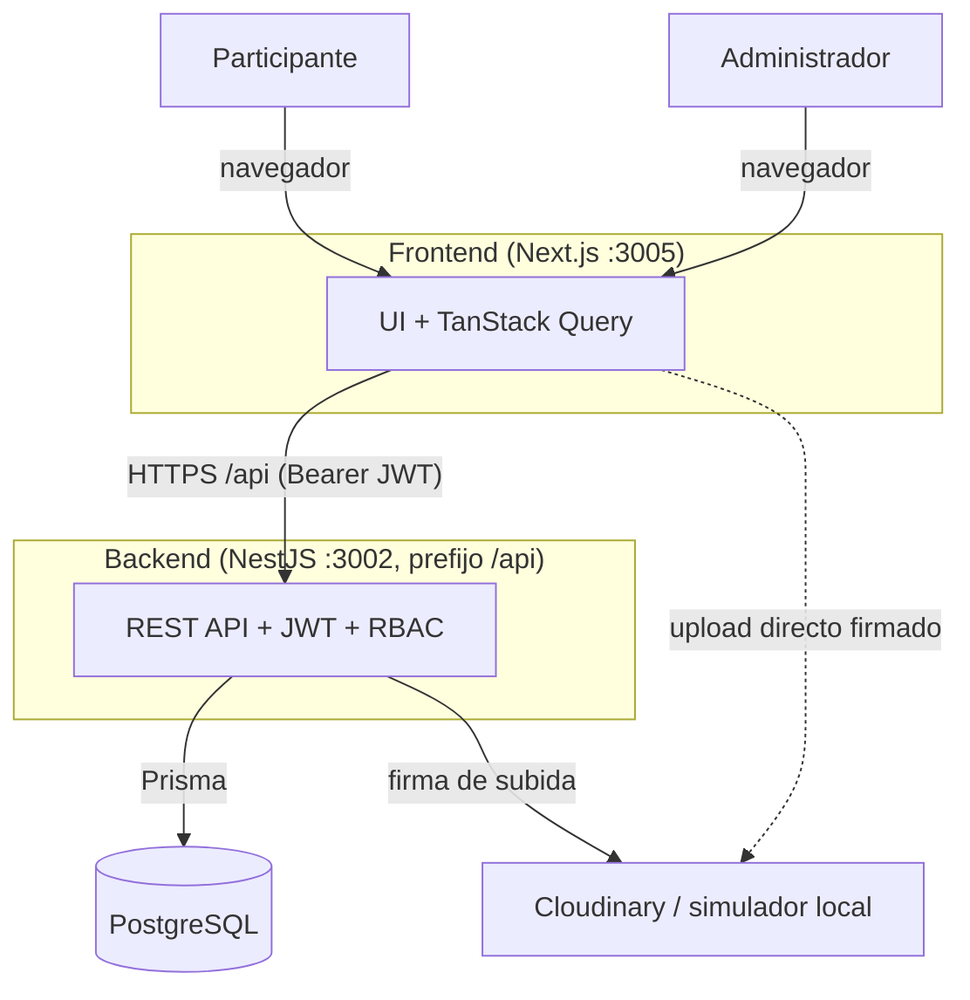

## 3. Módulos del backend

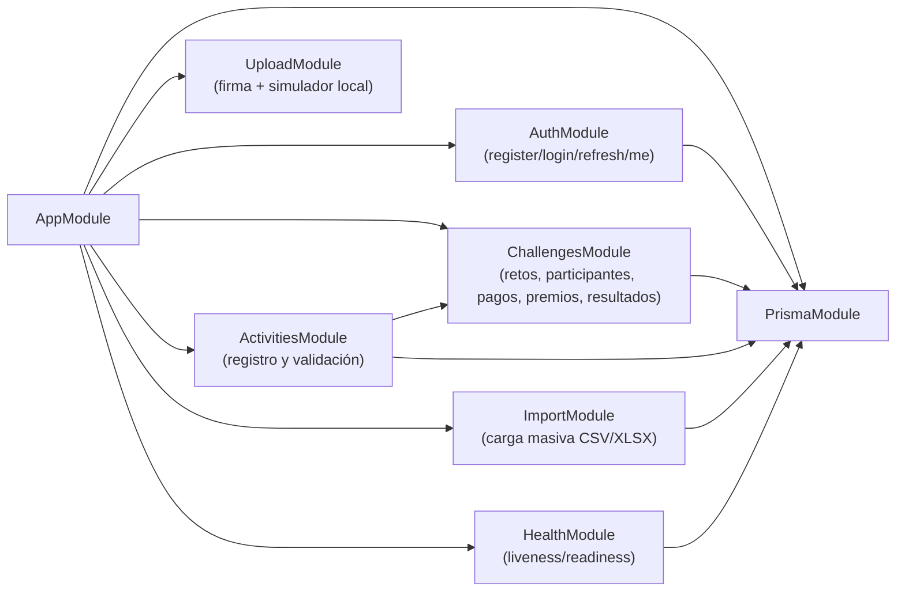

Guards transversales: `JwtAuthGuard` (autenticación) y `RolesGuard` + `@Roles(ADMIN)`
(autorización). Pipeline de cada request:

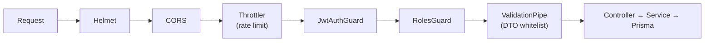

## 4. Modelo de datos

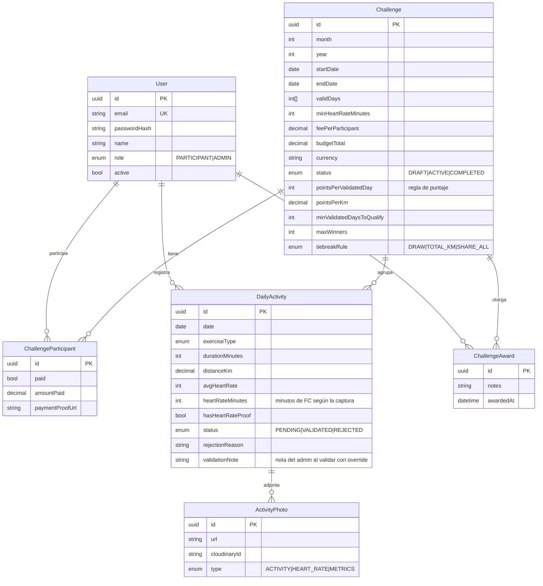

Restricciones clave:
- `Challenge` único por `(month, year)`.
- `ChallengeParticipant` único por `(challengeId, userId)`.
- `DailyActivity` única por `(challengeId, userId, date)` → 1 actividad por día.
- `ChallengeAward` único por `(challengeId, userId)`.

## 5. Estados

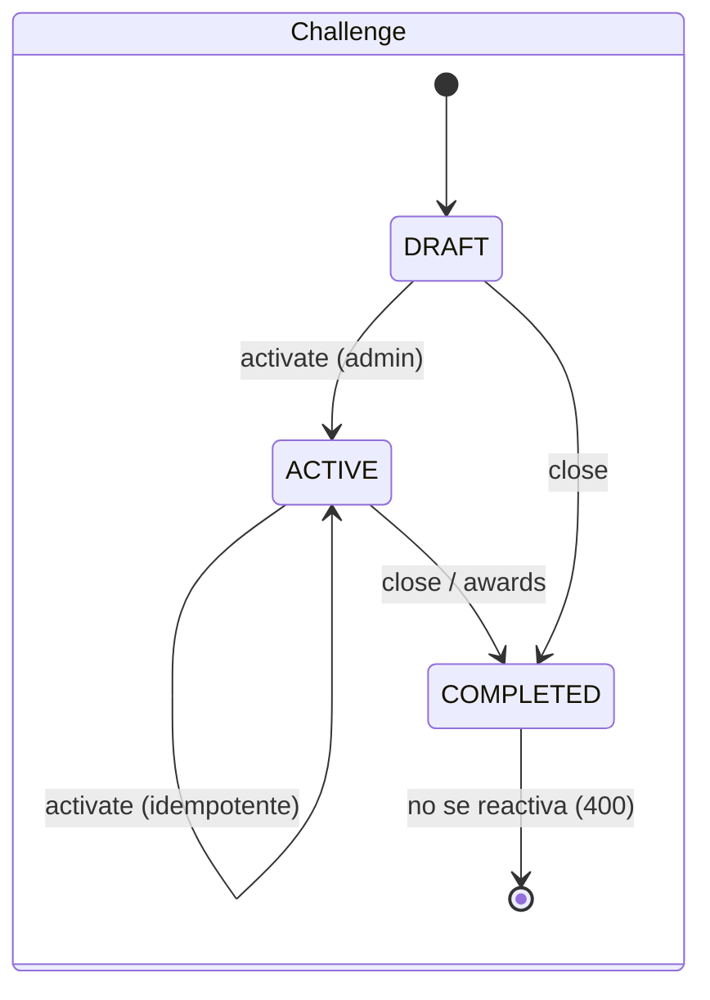

Varios retos pueden estar `ACTIVE` a la vez (spec `challenge-lifecycle`).
`GET /challenges/active/list` devuelve todos los activos (más reciente primero,
con `isParticipant`); `GET /challenges/active` devuelve el reto "por defecto"
del usuario (el más reciente donde participa, si no el más reciente activo).
La web muestra un selector de reto en el encabezado cuando hay más de uno.

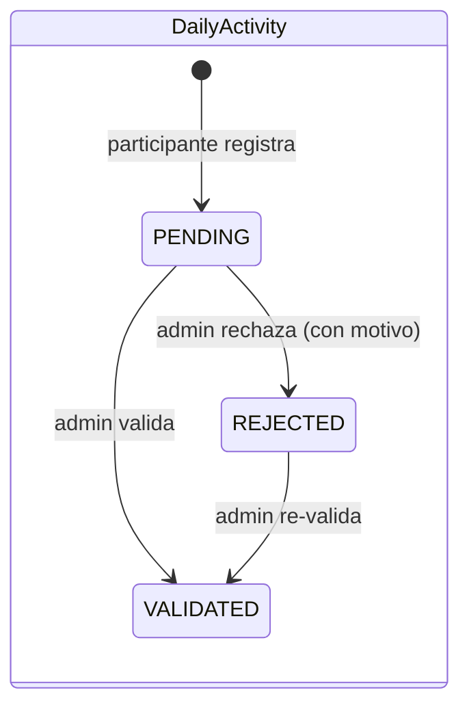

## 6. Flujo de autenticación

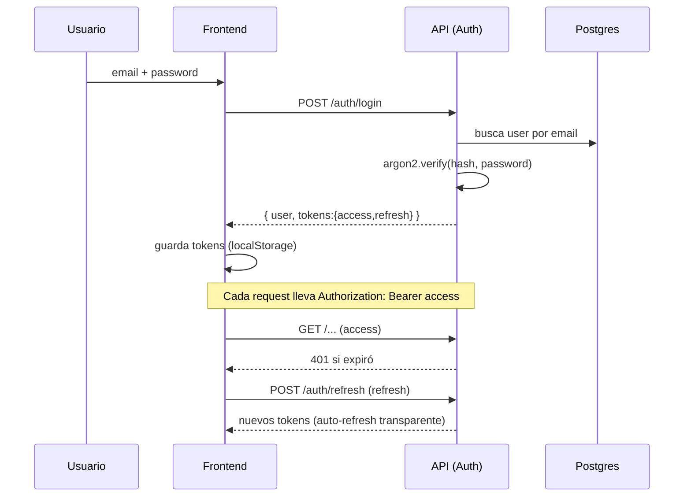

## 7. Flujo principal: actividad → validación → resultados

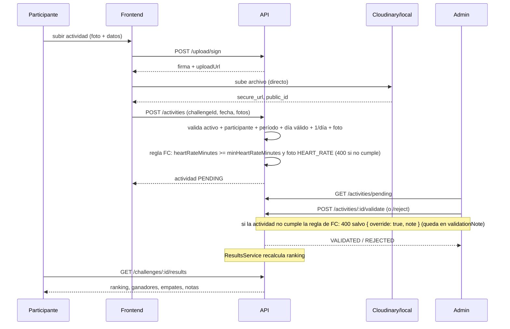

## 8. Flujo de premiación

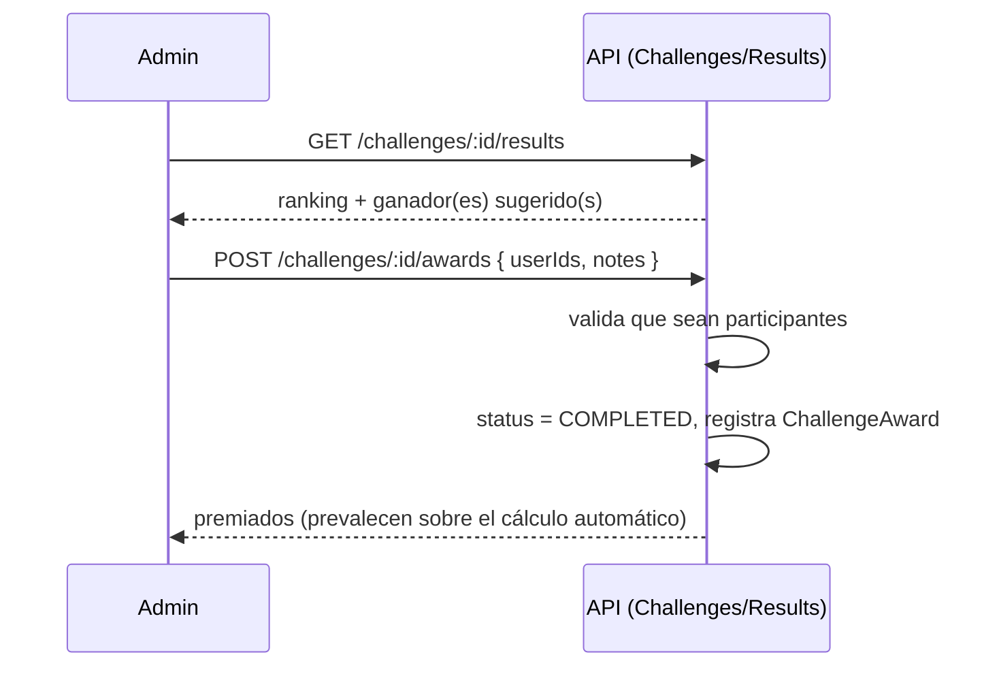

Reglas de ganador (en `ResultsService`, ver detalle y gaps en `docs/challenge-rules.md`):
1 tope → gana solo · 2 empate → ambos (dividen) · 3+ → sorteo de 2 · 0 → sin ganador.

## 9. Importación masiva

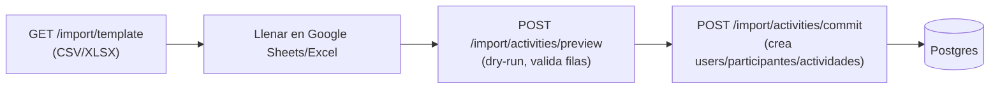

Idempotente según `duplicateStrategy` (`skip`/`update`); estado por defecto y password
temporal configurables. Detalle en `docs/import-template.md`.

## 10. Carga de archivos (dos modos)

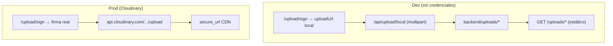

El backend detecta el modo en el arranque: si faltan `CLOUDINARY_*`, activa el
simulador local; el frontend usa el mismo cliente (`lib/cloudinary.ts`) sin cambios.

## 11. Despliegue (producción)

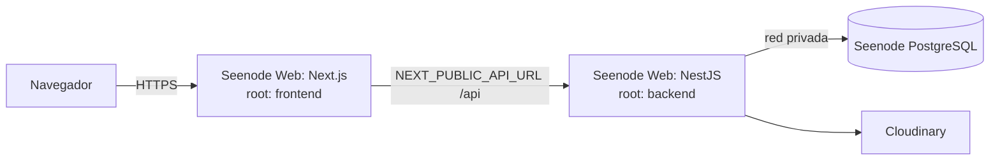

Comandos, variables y pasos: `docs/deploy-seenode.md`. Migraciones con
`prisma migrate deploy` en el arranque; healthcheck `/api/health`.

## 12. Endpoints (resumen)

| Área | Endpoint | Rol |
|---|---|---|
| Auth | `POST /auth/register` · `POST /auth/login` · `POST /auth/refresh` · `GET /auth/me` | público / autenticado |
| Retos | `POST /challenges` · `PATCH /challenges/:id` · `:id/activate` · `:id/close` · `:id/awards` · `GET :id/finance` | ADMIN |
| Retos | `GET /challenges` · `GET /challenges/active` · `GET /challenges/active/list` · `GET /challenges/:id` · `:id/results` · `:id/participants` | autenticado |
| Participantes | `POST/DELETE /challenges/:id/participants...` · `PATCH .../payment` | ADMIN |
| Pagos | `PATCH /challenges/:id/participants/me/payment-proof` | participante |
| Actividades | `POST /activities` · `GET /activities/me` · `DELETE /activities/:id` | autenticado |
| Actividades | `GET /activities` · `GET /activities/pending` · `:id/validate` · `:id/reject` | ADMIN |
| Upload | `POST /upload/sign` · `POST /upload/local` (dev) | autenticado / público(dev) |
| Import | `GET /import/template` · `POST /import/activities/preview` · `/commit` · `GET /import/sheet/status` · `POST /import/sheet/preview` · `/commit` | ADMIN |
| Health | `GET /health` · `GET /health/db` | público |
