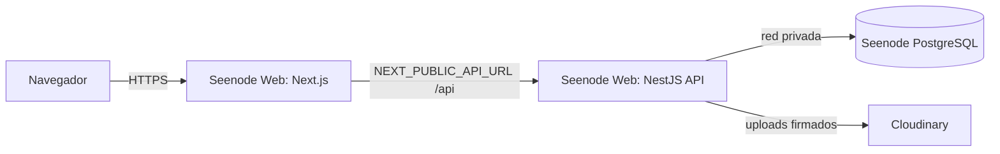

# Despliegue en Seenode (paso a paso)

Arquitectura objetivo: dos Web Services (API NestJS y frontend Next.js) + un
PostgreSQL administrado, todo en Seenode, con Cloudinary como servicio
complementario para imágenes.



Notas de plataforma (importantes):
- Seenode soporta monorepos con el campo **Root Directory** (apuntar a `backend` o `frontend`).
- Seenode **no inyecta la variable `PORT`**: el puerto se fija en el campo "Port"
  del panel y la app debe escuchar en `0.0.0.0` en ese mismo puerto.
- HTTPS y URL pública salen automáticamente por cada Web Service.

## 0. Prerrequisitos

- Repo en GitHub: `Professional-and-Personal-Branding/reto-constancia-mvp` (ya está).
- Cuenta de Cloudinary con `cloud name`, `api key`, `api secret`.
- Cuenta en Seenode (https://seenode.com), GitHub autorizado.

## 1. Base de datos (PostgreSQL administrado)

1. Panel de Seenode → **Databases** → **Create database**.
2. Tipo **PostgreSQL**, elige versión y tier (Basic alcanza para empezar).
3. Al crearse, copia la **connection string** (usa la de **red privada** para la API).
   Será el valor de `DATABASE_URL`. Asegúrate de incluir `?schema=public` si el proveedor no lo agrega.

## 2. Web Service: API (NestJS)

1. **New** → **Web Service** → conecta el repo y elige la rama **`main`**.
2. **Root Directory**: `backend`
3. **Build Command**:
   ```
   npm install && npx prisma generate && npm run build
   ```
4. **Start Command** (corre migraciones y arranca):
   ```
   npx prisma migrate deploy && node dist/main.js
   ```
5. **Port**: `3000` (el backend escucha en `PORT` con default 3000, y enlaza 0.0.0.0).
6. **Environment Variables**:
   - `DATABASE_URL` = (connection string de red privada del paso 1)
   - `JWT_SECRET` = (secreto fuerte; ver abajo)
   - `JWT_REFRESH_SECRET` = (otro secreto fuerte, distinto)
   - `JWT_ACCESS_EXPIRES_IN` = `15m`
   - `JWT_REFRESH_EXPIRES_IN` = `7d`
   - `API_PREFIX` = `api`
   - `PORT` = `3000`
   - `CORS_ORIGIN` = (URL pública del frontend; se completa tras el paso 3)
   - `CLOUDINARY_CLOUD_NAME`, `CLOUDINARY_API_KEY`, `CLOUDINARY_API_SECRET`
   - `CLOUDINARY_FOLDER` = `reto-constancia`
   - `SEED_ADMIN_EMAIL`, `SEED_ADMIN_PASSWORD`, `SEED_ADMIN_NAME` (para el primer seed)
7. Crea el servicio. Anota su URL pública (p. ej. `https://reto-api.seenode.app`).
8. Verifica salud: abre `https://<api>/api/health` (debe responder `{"status":"ok"}`)
   y `https://<api>/api/health/db` (debe responder `db: "up"`).

## 3. Web Service: Frontend (Next.js)

1. **New** → **Web Service** → mismo repo, rama **`main`**.
2. **Root Directory**: `frontend`
3. **Build Command**:
   ```
   npm install && npm run build
   ```
4. **Start Command** (fija el puerto explícitamente, Seenode no provee `PORT`):
   ```
   npx next start -p 3000
   ```
5. **Port**: `3000`
6. **Environment Variables**:
   - `NEXT_PUBLIC_API_URL` = `https://<api-del-paso-2>/api`
7. Crea el servicio. Anota su URL pública (p. ej. `https://reto-app.seenode.app`).

## 4. Cerrar el círculo (CORS) y primer seed

1. Vuelve al Web Service de la **API** → Environment Variables.
2. Pon `CORS_ORIGIN` = URL pública del frontend (sin slash final), redeploy.
3. Primer seed del admin (solo una vez): abre una shell del servicio API y corre:
   ```
   npx prisma db seed
   ```
   (Crea el admin a partir de `SEED_ADMIN_*`. En prod, cambia el password tras el primer login.)

## 5. Verificación end-to-end

- Entra a la URL del frontend, login con el admin.
- Crea un reto, inscribe participantes, sube/valida una actividad.
- Prueba la importación masiva en `Dashboard → Importar` (ver `docs/import-template.md`).

## Generar secretos fuertes

```bash
# Linux/macOS
openssl rand -base64 48
# Cualquier máquina con Node
node -e "console.log(require('crypto').randomBytes(48).toString('base64'))"
```

Genera uno para `JWT_SECRET` y otro distinto para `JWT_REFRESH_SECRET`.

## Notas de mantenimiento

- Cada push a `main` puede redeployar (Seenode redeploya al recibir push en la rama).
- Las migraciones se aplican solas en el arranque (`prisma migrate deploy`).
- Si cambias el esquema: crea la migración localmente
  (`npx prisma migrate dev --name <desc>`), súbela vía PR; al desplegar `main`
  se aplicará con `migrate deploy`.
- Mantén `DATABASE_URL` apuntando a la red privada para menor latencia y mayor seguridad.
